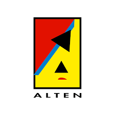
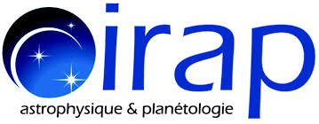

# Lydia Bouaoudia

##  Ingénieure en Machine Learning & Computer Vision

📍 Mobile dans toute la France  
📧 bouaoudialydiia@gmail.com  
📞 +33 7 69 40 31 88  
🔗 [LinkedIn](https://www.linkedin.com/in/lydia-bouaoudia/)

---

##  À propos de moi

Je suis jeune diplômée en **traitement du signal, traitement d’image et machine learning**, avec une forte appétence pour l’intelligence artificielle appliquée à des systèmes complexes et réels.

Je m’intéresse particulièrement à la **R&D en IA**, notamment à la conception de modèles capables de prendre des décisions, apprendre à partir de données hétérogènes et s’adapter à des environnements contraints comme l’industrie, l’énergie ou la vision par ordinateur.

J’aime travailler à l’interface entre la **modélisation mathématique, l’algorithmique et l’expérimentation**, où chaque idée doit être testée, optimisée et confrontée à des données réelles.

En parallèle de mes compétences techniques, je développe un fort intérêt pour la **gestion de projet**, en particulier dans des contextes collaboratifs et pluridisciplinaires, où la structuration des idées, la communication et la rigueur sont essentielles.

Curieuse et orientée solution, je cherche à évoluer dans des environnements où je peux :
- concevoir et améliorer des modèles d’intelligence artificielle
- explorer de nouvelles approches en apprentissage automatique
- contribuer à des systèmes innovants à fort impact

---

#  Expérience professionnelle 

##  Alten – Ingénieure stagiaire en IA  Industrie 4.0

---

##   IRAP – Traitement d’images spatiales

---

# 📫 Contact

📧 bouaoudialydiia@gmail.com  
🔗 LinkedIn : https://linkedin.com/in/lydiabouaoudia  
