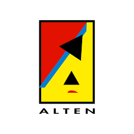

# Lydia Bouaoudia

##  Ingénieure en Machine Learning & Computer Vision

📍 Mobile dans toute la France  
📧 bouaoudialydiia@gmail.com  
📞 +33 7 69 40 31 88  
🔗 [LinkedIn](https://www.linkedin.com/in/lydia-bouaoudia/)

---

##  À propos de moi

Je suis jeune diplômée en **traitement du signal, traitement d’image et machine learning**, avec une forte appétence pour l’intelligence artificielle appliquée à des systèmes complexes et réels.

Je m’intéresse particulièrement à la **R&D en IA**, notamment à la conception de modèles capables de prendre des décisions, apprendre à partir de données hétérogènes et s’adapter à des environnements contraints comme l’industrie, l’énergie ou la vision par ordinateur.

J’aime travailler à l’interface entre la **modélisation mathématique, l’algorithmique et l’expérimentation**, où chaque idée doit être testée, optimisée et confrontée à des données réelles.

En parallèle de mes compétences techniques, je développe un fort intérêt pour la **gestion de projet**, en particulier dans des contextes collaboratifs et pluridisciplinaires, où la structuration des idées, la communication et la rigueur sont essentielles.

Curieuse et orientée solution, je cherche à évoluer dans des environnements où je peux :
- concevoir et améliorer des modèles d’intelligence artificielle
- explorer de nouvelles approches en apprentissage automatique
- contribuer à des systèmes innovants à fort impact

---

#  Expérience professionnelle 

##  Alten – Ingénieure stagiaire en  IA pour l’optimisation énergétique (Projet Green Factory)
###  Contexte : 

Ce stage s’inscrit dans le projet **Green Factory**, visant à réduire l’empreinte carbone des sites industriels en combinant intelligence artificielle, énergies renouvelables et optimisation énergétique. 

L’objectif était de concevoir un système capable d’optimiser en temps réel :
- l’utilisation des sources d’énergie (réseau, renouvelables, stockage)
- et le planning de production des machines de l'usine
  
  ---

### Résultats clés du projet

-Réalisation d’un état de l’art complet
-Développement des premiers prototypes
-Validation du projet dans le cadre du Crédit d’Impôt Recherche (note A)

---

###  Ce que j’ai développé

- Agent de **Reinforcement Learning (PPO)**
- Simulation complète d’une usine (Gymnasium)
- Intégration de modèles prédictifs (LSTM)
- Système hybride : IA + règles expertes
- Interface interactive avec Streamlit

###  Gestion de projet 

- Coordination d’une équipe projet
- Définition des axes de recherche
- Développement complet du système 
- Rédaction scientifique (Bilan technique et scientifique pour le crédit impot recherche , rapport de stage )
  
- ###  Méthodologie

- Approche **Agile (sprints, daily, weekly)**
- Collaboration multidisciplinaire

Travail réalisé en **forte autonomie** dans un contexte peu structuré au départ

---

###  Démo

👉 [Tester la vidéo](videos/Bouaoudia_simulation_green_factory.mp4)

---

Voir les détails techniques

### Architecture du système

Le système repose sur plusieurs composants clés :

#### Environnement simulé
- Simulation d'une usine réaliste sous Python

#### Données
- Données réelles récupérées via API  
- Données simulées à partir du modèle d’usine  

#### Modèle IA
- Algorithme **PPO (Proximal Policy Optimization)**  
- Apprentissage par renforcement basé sur un système de récompenses et la minimisation d’une fonction de coût  
- Utilisation de **TensorBoard** pour le suivi des performances et l’ajustement des hyperparamètres  

#### Interface utilisateur
- Visualisation et analyse des résultats avec **Streamlit**  

---

### Démarche expérimentale

Le projet a été structuré en plusieurs phases :

1. **Phase 1 : Simulation**
   - Entraînement sur données synthétiques  
   - Feedback aléatoire  

2. **Phase 2 : Données réelles**
   - Normalisation des données  
   - Feedback semi-automatique basé sur des règles  

3. **Phase 3 : Modèle hybride**
   - Combinaison apprentissage par renforcement + règles expertes  
   - Amélioration de la stabilité et des performances  

---

##   IRAP – Traitement d’images spatiales

---

# 📫 Contact

📧 bouaoudialydiia@gmail.com  
🔗 LinkedIn : https://linkedin.com/in/lydiabouaoudia  
